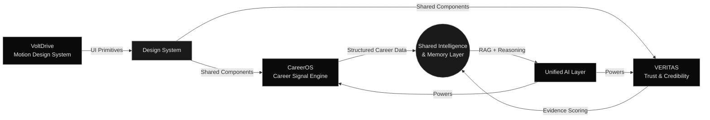
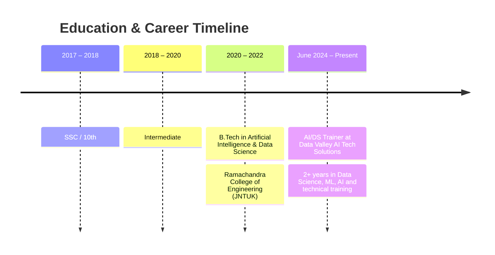

<div align="center">


<br/>

<a href="https://www.thenameisbhagavan.in"></a>&nbsp;
<a href="https://linkedin.com/in/bhagavan"></a>&nbsp;
<a href="mailto:hello@thenameisbhagavan.in"></a>&nbsp;
<a href="https://github.com/thenameisbhagavan"></a>

<sub><br/>Gopala Josyula Siva Satya Sai Bhagavan · AI/ML Engineer | Software Engineer | AI/DS Trainer | Problem Solver · Andhra Pradesh, India · </sub>

</div>

<br/>


<br/>

<table width="100%"><tr><td width="6px" style="background:#1A1A1A"></td><td>

### AI/DS Trainer / Technical Trainer
**Data Valley AI Tech Solutions · Vijayawada, Andhra Pradesh, India**
**June 2024 — Present · Full-time**

Working continuously at Data Valley since June 2024, with 2+ years of experience in Data Science, Artificial Intelligence, Machine Learning, Deep Learning, Generative AI, and Python. The work centers on technical training, student mentoring, practical workshops, project-based learning, and industry-oriented technical education.

</td></tr></table>

<br/>


<br/>

<table width="100%">
<tr>
<td width="50%" valign="top">
<h3>🧠 CareerOS</h3>
<i>AI Career Intelligence Platform</i>

Turns a resume and a GitHub profile into a single reasoning layer — ATS scoring, GitHub signal analysis, market intelligence, and an AI-generated roadmap, served through a decoupled Flask/FastAPI backend with live Gemini synthesis.

`React` `Flask` `FastAPI` `Gemini`

**[Live →](https://careeros-thenameisbhagavan.vercel.app/)** &nbsp;·&nbsp; **[Source →](https://github.com/thenameisbhagavan/careeros)**

</td>
<td width="50%" valign="top">
<h3>🌌 AuraOS</h3>
<i>Personal Intelligence Operating System</i>

A memory layer for AI that doesn't forget — Django + FastAPI microservices with Pinecone as persistent vector memory, RAG retrieval, and conversational reasoning built on top.

`Django` `FastAPI` `Pinecone` `Gemini`

**[Live →](https://aura-os-thenameisbhagavan.vercel.app/)** &nbsp;·&nbsp; **[Source →](https://github.com/thenameisbhagavan/auraos)**

</td>
</tr>
<tr>
<td width="50%" valign="top">
<h3>🔍 VERITAS</h3>
<i>Explainable Intelligence Platform</i>

Fact-checking without a black-box LLM crutch — claim extraction, live evidence retrieval, credibility scoring, and bias detection on a pure NLP/ML pipeline.

`React` `Flask` `spaCy` `Transformers`

**[Live →](https://veritas-thenameisbhagavan.vercel.app/)** &nbsp;·&nbsp; **[Source →](https://github.com/thenameisbhagavan/veritas)**

</td>
<td width="50%" valign="top">
<h3>⚡ VoltDrive</h3>
<i>Luxury Electric Vehicle Experience</i>

A production-grade automotive showcase — cinematic scroll storytelling, interactive vehicle exploration, and Apple-level motion polish.

`React` `Vite` `Framer Motion`

**[Live →](https://voltdrive-thenameisbhagavan.vercel.app/)** &nbsp;·&nbsp; **[Source →](https://github.com/thenameisbhagavan/voltdrive)**

</td>
</tr>
</table>

<br/>

<details>
<summary><b>↳ Expand for case-study depth on each system</b></summary>
<br/>

**CareerOS** — *Problem:* career signal is scattered across resumes, GitHub, and job boards with no reasoning layer over it. *Approach:* live GitHub API ingestion → resume/ATS parsing → Gemini-driven roadmap synthesis. *Modules:* Resume Intelligence · ATS Analyzer · GitHub Analyzer · Market Intelligence · Roadmap Generator.

**AuraOS** — *Problem:* most AI assistants lose all continuity between sessions. *Approach:* Pinecone-backed vector memory with RAG retrieval feeding a conversational reasoning engine. *Modules:* Persistent Memory · RAG Retrieval · Reasoning Engine.

**VERITAS** — *Problem:* LLM-based fact-checkers can't explain *why* something is credible. *Approach:* zero-LLM NLP pipeline — spaCy + Transformers + scikit-learn for extraction, retrieval, scoring, and bias detection. *Modules:* Claim Extraction · Evidence Retrieval · Credibility Scoring · Bias Detection.

**VoltDrive** — *Problem:* automotive showcases rarely match the polish of the product they sell. *Approach:* scroll-driven cinematic motion built on Framer Motion with a reusable interaction library. *Modules:* Vehicle Explorer · Scroll Narrative Engine · Motion Design Library.

</details>

<br/>


<br/>

<table width="100%"><tr><td width="6px" style="background:#1A1A1A"></td><td>

*"Systems, not screens. Every product here is built to reason, remember, and explain itself — not just render UI."*

B.Tech Artificial Intelligence & Data Science graduate and AI/DS professional with 2+ years of experience at Data Valley AI Tech Solutions. I enjoy turning ideas into practical software, building intelligent systems, teaching technical concepts, and understanding the engineering logic behind the systems I build. This is **TheNameIsBhagavan** — a long-term engineering ecosystem where four systems anchor the work: retrieval, reasoning, trust, and motion.

**Build → Teach → Share → Improve**

</td></tr></table>

<table width="100%">
<tr>
<td width="33%" valign="top">

**🤖 AI / Machine Learning**
Machine Learning · Deep Learning · Computer Vision · NLP · Generative AI

</td>
<td width="33%" valign="top">

**🛠️ Software Engineering**
Python · FastAPI · React · Node.js · SQL · MongoDB

</td>
<td width="33%" valign="top">

**🧩 Problem Solving**
Data Structures & Algorithms · Logical Problem Solving · Competitive Programming · LeetCode

</td>
</tr>
</table>

<br/>


<br/>

<div align="center">



</div>

<br/>


<br/>

<table width="100%">
<tr><td width="18%"><b>AI / ML</b></td><td>Machine Learning · Deep Learning · Computer Vision · NLP · Generative AI · LLMs · RAG · AI Agents</td></tr>
<tr><td><b>Programming</b></td><td>Python · JavaScript · SQL</td></tr>
<tr><td><b>Backend</b></td><td>FastAPI · Flask · Node.js · Express.js</td></tr>
<tr><td><b>Frontend</b></td><td>React · Vite · React Router</td></tr>
<tr><td><b>Databases</b></td><td>MongoDB · SQL databases · Vector Databases</td></tr>
<tr><td><b>Engineering</b></td><td>Git · GitHub · REST APIs · System Design</td></tr>
</table>

<div align="center"><br/>

</div>

<br/>

```
Python                 ████████████████████░░  90%
React / JavaScript     ██████████████████░░░░  85%
FastAPI / Flask        █████████████████░░░░░  82%
Deep Learning / NLP    ████████████████░░░░░░  78%
System Design          ███████████████░░░░░░░  74%
DevOps / Cloud         █████████████░░░░░░░░░  65%
```

<br/>


<br/>



<table width="100%"><tr><td width="6px" style="background:#1A1A1A"></td><td>

**B.Tech, Artificial Intelligence & Data Science**
Ramachandra College of Engineering (JNTUK) · 2020 – 2022
Coursework — Machine Learning · Deep Learning · Data Structures & Algorithms · Distributed Systems · NLP

</td></tr></table>

<table width="100%">
<tr><td width="22%"><b>2017 – 2018</b></td><td>SSC / 10th</td></tr>
<tr><td><b>2018 – 2020</b></td><td>Intermediate</td></tr>
<tr><td><b>2020 – 2022</b></td><td>B.Tech — Artificial Intelligence & Data Science</td></tr>
<tr><td><b>June 2024 – Present</b></td><td>Data Valley AI Tech Solutions</td></tr>
</table>

<br/>


<br/>

<div align="center">


<br/>


</div>

<br/>


<br/>


<div align="center"><br/>


<br/><br/>


<br/><br/>


</div>

<br/>


<br/>

<table width="100%">
<tr><td width="22%">🌍 Based in</td><td>Vijayawada, Andhra Pradesh, India</td></tr>
<tr><td>🧭 Current focus</td><td>AI/ML · Data Science · GenAI · Software Engineering</td></tr>
<tr><td>💼 Current role</td><td>AI/DS Trainer @ Data Valley AI Tech Solutions</td></tr>
<tr><td>🎯 Status</td><td>Building · Teaching · Sharing</td></tr>
</table>

<div align="center">

<a href="https://github.com/sponsors/thenameisbhagavan"></a>&nbsp;
<a href="https://www.buymeacoffee.com/thenameisbhagavan"></a>

<br/><br/>

```
$ whoami
Gopala Josyula Siva Satya Sai Bhagavan — AI/ML Engineer | Software Engineer | AI/DS Trainer

$ role
AI/DS Trainer @ Data Valley AI Tech Solutions

$ experience
2+ Years at Data Valley · June 2024 — Present

$ location
Vijayawada, Andhra Pradesh, India

$ reach
linkedin.com/in/bhagavan · hello@thenameisbhagavan.in · thenameisbhagavan.in
```

<br/>

Currently building the **Engineering Journal** — architecture write-ups on CareerOS, AuraOS, VERITAS & VoltDrive.
<sub>Follow along at <a href="https://www.thenameisbhagavan.in">thenameisbhagavan.in</a></sub>

<br/><br/>


</div>
