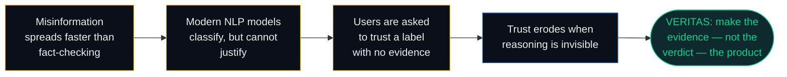
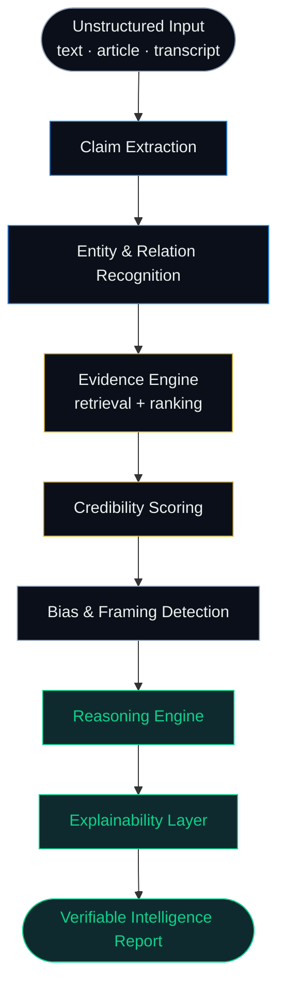
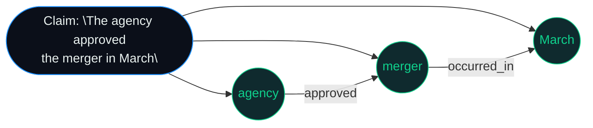
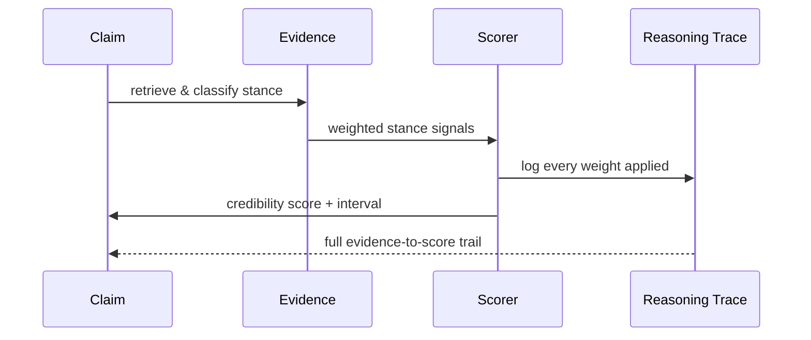
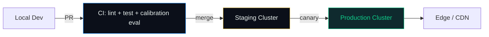
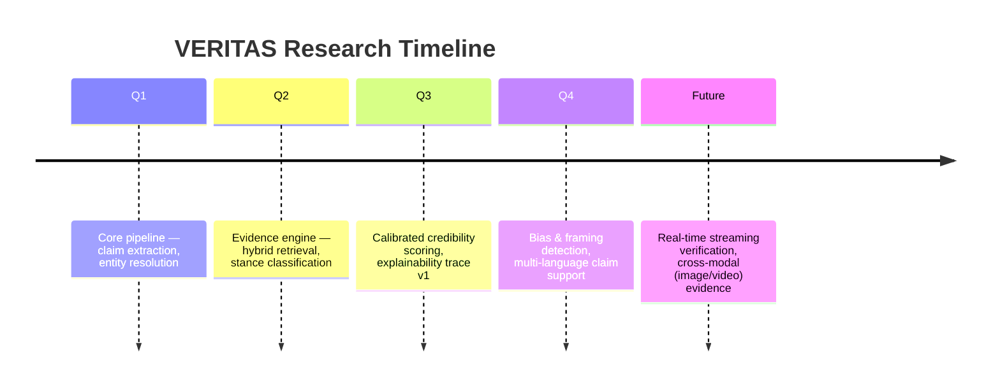

<div align="center">

<!-- ============================================================
     VERITAS — Explainable Intelligence Platform
     Premium README — top-tier product launch experience
     ============================================================ -->


<br/>

<a href="#">
  
</a>

<br/><br/>

<!-- STATUS / QUALITY BADGES -->
<p>
  
  
  
  
</p>

<p>
  
  
  
  
  
</p>

<sub>⚠️ <b>Placeholder notice:</b> replace <code>your-org/veritas</code>, live-site URLs, and screenshot paths marked below before publishing.</sub>

<br/>

<a href="#-quick-navigation"><b>Navigate</b></a> ·
<a href="#-live-deployment">Live Demo</a> ·
<a href="#-intelligence-pipeline">Pipeline</a> ·
<a href="#-architecture">Architecture</a> ·
<a href="#-roadmap">Roadmap</a> ·
<a href="#-contributing">Contributing</a>

</div>


<br/>

## 01 · Manifesto

> **Information moves faster than judgment.**
> A claim can circle the globe before evidence for or against it has even been gathered. The systems built to help — keyword filters, sentiment classifiers, black-box "fake news" detectors — were never built to *explain themselves*. They output a label. They withhold their reasoning. And a label without reasoning is not intelligence — it's a guess wearing a lab coat.

**VERITAS exists to close that gap.**

VERITAS is an **Explainable Intelligence Platform** — it does not tell you *what* to believe. It shows you **what was found, where it came from, how strongly it supports or contradicts a claim, and why the system weighed it the way it did.** Every score is traceable. Every conclusion is auditable. Every step of reasoning is inspectable.

<div align="center">
<table>
<tr>
<td width="50%" valign="top">

### VERITAS is **not**

- ❌ A "fake news" detector
- ❌ A binary true/false classifier
- ❌ A sentiment-flavored NLP demo
- ❌ A black box you're asked to trust

</td>
<td width="50%" valign="top">

### VERITAS **is**

- ✅ An Evidence Engine
- ✅ A Claim Verification Platform
- ✅ A Reasoning & Explainability System
- ✅ A research-grade Truth Intelligence Engine

</td>
</tr>
</table>
</div>

<br/>

## 02 · Why This Exists



**The insight VERITAS is built on:** explainability is not a feature bolted onto a verdict — it *is* the verdict. A credibility score without a visible evidence trail is not more trustworthy than a coin flip; it's simply a coin flip with better production values.

<br/>

## 03 · Quick Navigation

<div align="center">

| | | | |
|:---:|:---:|:---:|:---:|
| [🧠 Intelligence Pipeline](#-intelligence-pipeline) | [🔍 Claim Extraction](#-claim-extraction) | [🕸️ Entity Recognition](#-entity--relation-recognition) | [📚 Evidence Engine](#-evidence-engine) |
| [⚖️ Credibility Scoring](#-credibility-scoring) | [💡 Explainability Engine](#-explainability-engine) | [🎭 Bias Detection](#-bias--framing-detection) | [📄 Report Generator](#-report-generator) |
| [🏛️ Architecture](#-architecture) | [🗂️ Folder Structure](#-folder-structure) | [🧰 Tech Stack](#-technology-stack) | [🚀 Deployment](#-deployment) |
| [🔐 Security](#-security) | [⚡ Performance](#-performance) | [📈 Scalability](#-scalability) | [🗺️ Roadmap](#-roadmap) |

</div>

<br/>

## 04 · Live Deployment

<div align="center">

<table>
<tr>
<td align="center" width="33%">
<b>🌐 Live Platform</b><br/><br/>
<a href="https://veritas.example.com"></a>
<br/><sub>PLACEHOLDER — replace with production URL</sub>
</td>
<td align="center" width="33%">
<b>📦 Repository</b><br/><br/>
<a href="https://github.com/your-org/veritas"></a>
<br/><sub>PLACEHOLDER — replace with repo URL</sub>
</td>
<td align="center" width="33%">
<b>📖 Research Docs</b><br/><br/>
<a href="https://docs.veritas.example.com"></a>
<br/><sub>PLACEHOLDER — replace with docs URL</sub>
</td>
</tr>
</table>

</div>

<br/>

## 05 · Product Philosophy

VERITAS is engineered around four non-negotiable principles. Each one shapes an architectural decision downstream — none of them are marketing copy.

<table>
<tr><td width="25%" align="center"><b>🔎 Evidence Before Verdict</b></td><td>No score is emitted without an attached, inspectable evidence set. If the system cannot cite a source, it does not render a confidence value — it reports insufficient evidence.</td></tr>
<tr><td align="center"><b>🪞 Reasoning Is a First-Class Output</b></td><td>The reasoning trace is not a debug log — it is returned to the caller as structured, versioned output with the same API contract guarantees as the score itself.</td></tr>
<tr><td align="center"><b>⚖️ Calibration Over Confidence</b></td><td>VERITAS is optimized against calibration error (ECE), not raw accuracy. A system that is right 70% of the time and *knows* it is right 70% of the time is more useful than one that is right 80% of the time and claims 99%.</td></tr>
<tr><td align="center"><b>🧭 Bias Is Surfaced, Not Hidden</b></td><td>Source-level bias and framing signals are attached to evidence rather than silently folded into a single opaque score, so a downstream reader can discount a source themselves.</td></tr>
</table>

<br/>


<br/>

## 06 · Intelligence Pipeline

VERITAS processes unstructured input through eight discrete, independently-auditable stages. Nothing is a monolith — every stage emits a typed, inspectable artifact that the next stage consumes.



Each stage below documents its **problem**, **solution**, **engineering decision**, and **research value** — not just what it does, but why it was built this way.

<br/>

## 07 · Claim Extraction

**Problem.** Free text mixes assertions, questions, hedges, and opinions in the same sentence. Naively treating every sentence as a checkable claim floods downstream evidence retrieval with noise and burns retrieval budget on unfalsifiable statements.

**Solution.** A claim-segmentation model decomposes input into atomic, checkable propositions — separating factual assertions from opinion, speculation, and rhetorical framing — and assigns each proposition a *checkability score* before it's allowed downstream.

**Engineering decision.** Claim extraction runs as a two-pass system: a fast syntactic pass (dependency parsing) filters obviously non-factual spans cheaply, and only the surviving candidates go through the more expensive semantic checkability model. This keeps median latency low without sacrificing recall on genuinely checkable claims.

**Research value.** Atomic claim decomposition is what makes every downstream score *attributable to a specific sentence*, rather than to a whole document — this is the structural choice that makes explainability possible at all.

<br/>

## 08 · Entity & Relation Recognition

**Problem.** A claim like *"the agency approved the merger in March"* is meaningless to a verification system unless "the agency," "the merger," and the temporal anchor are resolved to concrete, disambiguated entities.

**Solution.** A named-entity and relation extraction layer resolves mentions to a canonical knowledge graph node (or flags them as unresolved), and extracts the relation triples that evidence retrieval will search against.



**Engineering decision.** Unresolved entities are never silently dropped — they propagate as an explicit `unresolved_entity` flag, which downstream confidence calibration treats as a hard penalty. Guessing at entity identity is treated as a worse failure mode than admitting ambiguity.

**Research value.** Grounding claims in a knowledge graph (rather than raw text matching) is what allows evidence retrieval to search by *relation*, not just keyword overlap — this materially improves recall on paraphrased or reworded claims.

<br/>

## 09 · Evidence Engine

**Problem.** Retrieval-only systems return documents that are topically related but don't actually confirm or deny the claim — "relevant" and "probative" are not the same thing.

**Solution.** A hybrid dense + sparse retriever pulls a broad candidate set, and a stance-classification re-ranker scores each candidate as **supporting**, **refuting**, or **unrelated** to the specific claim — not just the general topic.

<table>
<tr><td width="20%" align="center"><b>Stage</b></td><td width="40%" align="center"><b>Function</b></td><td width="40%" align="center"><b>Output</b></td></tr>
<tr><td align="center">Candidate Retrieval</td><td>Hybrid BM25 + dense vector search across the source corpus</td><td>Top-k topically relevant documents</td></tr>
<tr><td align="center">Stance Classification</td><td>Per-claim, per-document stance re-ranking</td><td>support / refute / unrelated + confidence</td></tr>
<tr><td align="center">Source Provenance</td><td>Publisher, publication date, and citation-chain resolution</td><td>Provenance metadata attached to every evidence item</td></tr>
</table>

**Engineering decision.** Stance classification is scoped *per claim–document pair*, never at the document level, because a single article routinely supports one claim while refuting another. Document-level stance labels were tried early and discarded — they destroyed precision on multi-claim articles.

**Research value.** Separating "found it" from "it agrees with the claim" is the single biggest lever on false-confidence reduction in claim verification systems.

<br/>

## 10 · Credibility Scoring

**Problem.** A confidence number with no calibration is worse than no number — it invites false certainty.

**Solution.** Credibility is computed as a weighted aggregation over: evidence stance agreement, source diversity, source historical reliability, and recency — then explicitly calibrated against a held-out human-annotated benchmark rather than reported raw.

**Engineering decision.** VERITAS reports scores with confidence *intervals*, not point estimates, and refuses to emit a score at all below a minimum-evidence threshold — returning `insufficient_evidence` instead of forcing a guess.

**Research value.** Optimizing for **Expected Calibration Error (ECE)** rather than accuracy alone means the system's stated confidence is meaningful — a 70% score should be right roughly 70% of the time, not 95% or 40% of the time.

<br/>

## 11 · Explainability Engine

**Problem.** Most "explainable AI" retrofits an explanation onto a decision the model already made — the explanation is generated *after* the verdict and often doesn't reflect the actual decision path.

**Solution.** VERITAS's reasoning trace is generated **during** inference, not after — every weight, evidence item, and stance classification that contributed to the final score is logged as a structured, replayable trace, so the explanation *is* the decision path, not a plausible-sounding story about it.



**Engineering decision.** The trace is versioned and stored alongside the score — if the underlying model is updated, historical traces remain replayable against the model version that produced them, which matters enormously for audit and research reproducibility.

**Research value.** This is what separates VERITAS from post-hoc explainability tools like SHAP or LIME applied to a black-box classifier: the explanation was never separate from the reasoning, so there's nothing to reverse-engineer.

<br/>

## 12 · Bias & Framing Detection

**Problem.** Two sources can both be factually accurate and still frame the same event in ways that push a reader toward different conclusions.

**Solution.** A framing-analysis layer runs alongside stance classification, surfacing loaded language, selective emphasis, and source-level historical lean — attached to the evidence as metadata, never folded into the credibility score itself.

**Engineering decision.** Bias signals are kept **structurally separate** from credibility scores by design. Conflating "is this true" with "is this framed neutrally" was identified early as a research anti-pattern that quietly launders editorial judgment into a number that looks objective.

**Research value.** Presenting bias as a separate, inspectable axis — rather than a hidden penalty term — respects the reader's own judgment instead of substituting for it.

<br/>

## 13 · Report Generator

**Problem.** A JSON blob of scores is not usable by a human analyst under time pressure.

**Solution.** The report layer renders the full reasoning trace, evidence set, and credibility breakdown into a structured, citation-linked report — web, PDF, and API formats — so the same evidence trail an engineer can query is the one an analyst can read.

<div align="center">

<!-- SCREENSHOT PLACEHOLDER -->

<br/><sub>PLACEHOLDER — replace with an actual product screenshot or demo GIF</sub>

</div>

<br/>

## 14 · Dashboard Preview

<div align="center">


<br/><sub>PLACEHOLDER — replace with dashboard screenshot / animated product demo GIF</sub>

</div>

<br/>


<br/>

## 15 · Architecture

```mermaid
flowchart TB
    subgraph Client["Client Layer"]
        WEB[Web App — Next.js]
        API_C[API Consumers]
    end

    subgraph Gateway["API Gateway"]
        GW[GraphQL / REST Gateway]
        AUTH[Auth & Rate Limiting]
    end

    subgraph Core["Intelligence Core"]
        CE[Claim Extraction Service]
        ER[Entity Resolution Service]
        EV[Evidence Engine]
        CS[Credibility Scorer]
        XP[Explainability Service]
    end

    subgraph Data["Data Layer"]
        VDB[(Vector Store)]
        KG[(Knowledge Graph)]
        PG[(PostgreSQL)]
        CACHE[(Redis Cache)]
    end

    subgraph Infra["Platform"]
        QUEUE[Task Queue]
        WORKERS[Async Workers]
        OBS[Observability / Tracing]
    end

    WEB --> GW
    API_C --> GW
    GW --> AUTH --> CE
    CE --> ER --> EV
    EV --> VDB
    EV --> KG
    EV --> CS --> XP
    XP --> PG
    CE -.-> QUEUE --> WORKERS
    Core -.-> OBS
    EV --> CACHE

    style Core fill:#0F2A2E,stroke:#0FD08C
    style Data fill:#0B0F19,stroke:#D4AF37
    style Gateway fill:#0B0F19,stroke:#1E90FF
```



**Engineering decision.** The Intelligence Core is deliberately decomposed into independently deployable services rather than a single inference monolith — each stage has different scaling characteristics (entity resolution is cheap and stateless; evidence retrieval is I/O-bound; credibility scoring is compute-bound), and coupling them would mean scaling the cheapest stage to match the most expensive one.

<br/>

## 16 · Frontend Architecture

<table>
<tr><td width="30%" align="center"><b>Layer</b></td><td width="70%" align="center"><b>Choice & Rationale</b></td></tr>
<tr><td align="center">Framework</td><td>Next.js (App Router) — server components for evidence-heavy pages, streaming for report generation</td></tr>
<tr><td align="center">State</td><td>React Query for server state; evidence trees are cached per claim to avoid re-fetching large reasoning traces</td></tr>
<tr><td align="center">Visualization</td><td>D3.js for the knowledge graph and evidence-timeline views; these are hand-built rather than a generic charting library, since the interaction model (click an edge → see the evidence trace) is domain-specific</td></tr>
<tr><td align="center">Design System</td><td>Custom component library — glassmorphic research cards, evidence-timeline primitives, credibility-interval widgets</td></tr>
</table>

<br/>

## 17 · Backend Architecture

<table>
<tr><td width="30%" align="center"><b>Layer</b></td><td width="70%" align="center"><b>Choice & Rationale</b></td></tr>
<tr><td align="center">API</td><td>GraphQL gateway federating the Intelligence Core services, plus a REST surface for simple claim-check integrations</td></tr>
<tr><td align="center">Core Services</td><td>Python (FastAPI) for ML-heavy stages; Go for the low-latency gateway and auth layer</td></tr>
<tr><td align="center">Retrieval</td><td>Hybrid vector store (dense embeddings) + inverted index (sparse/BM25), fused at query time</td></tr>
<tr><td align="center">Knowledge Graph</td><td>Graph database for entity/relation resolution, versioned so historical claims resolve against the graph state at time-of-check</td></tr>
<tr><td align="center">Async Processing</td><td>Task queue + worker pool for evidence retrieval and scoring, since these are the highest-latency, most parallelizable stages</td></tr>
</table>

<br/>

## 18 · Folder Structure

```text
veritas/
├── apps/
│   ├── web/                    # Next.js frontend — dashboard, reports, evidence explorer
│   └── api-gateway/            # GraphQL/REST gateway, auth, rate limiting
├── services/
│   ├── claim-extraction/       # Claim segmentation + checkability scoring
│   ├── entity-resolution/      # NER + knowledge graph linking
│   ├── evidence-engine/        # Hybrid retrieval + stance classification
│   ├── credibility-scoring/    # Calibrated scoring + confidence intervals
│   ├── explainability/         # Reasoning trace generation + storage
│   └── bias-detection/         # Framing / loaded-language analysis
├── packages/
│   ├── knowledge-graph-client/ # Shared graph query layer
│   ├── ui-kit/                 # Shared design system components
│   └── schema/                 # Shared GraphQL / protobuf schemas
├── infra/
│   ├── terraform/              # Cloud infrastructure as code
│   ├── k8s/                    # Deployment manifests
│   └── observability/          # Tracing, metrics, dashboards
├── research/
│   ├── notebooks/              # Calibration studies, benchmark evaluation
│   └── benchmarks/             # Held-out annotated evaluation sets
└── docs/
    ├── architecture/
    └── api-reference/
```

<br/>

## 19 · Technology Stack

<div align="center">

<table>
<tr><td align="center" width="20%"><b>Layer</b></td><td width="80%"><b>Technologies</b></td></tr>
<tr><td align="center">Frontend</td><td>


</td></tr>
<tr><td align="center">Core Services</td><td>


</td></tr>
<tr><td align="center">Data</td><td>


</td></tr>
<tr><td align="center">Platform</td><td>


</td></tr>
</table>

</div>

<br/>

## 20 · Deployment



Every deploy to production runs the full **calibration benchmark suite**, not just unit tests — a change that improves accuracy but degrades calibration (ECE) fails the pipeline. This is a deliberate departure from typical ML CI, where accuracy alone gates release.

<br/>

## 21 · Security

- **Source integrity** — evidence provenance is cryptographically hashed at ingestion time so a citation can be verified against tampering after the fact.
- **Least-privilege data access** — the knowledge graph and vector store are accessed exclusively through the evidence engine's service boundary; no downstream service holds direct credentials.
- **Audit logging** — every credibility score is immutably logged with its full reasoning trace ID, enabling after-the-fact audit of any published conclusion.
- **Input isolation** — claim extraction runs in a sandboxed inference environment isolated from the knowledge graph write path, limiting the blast radius of adversarial input.

<br/>

## 22 · Performance

<div align="center">

| Metric | Target | Notes |
|:--|:--:|:--|
| Claim extraction latency (p95) | < 200ms | Two-pass syntactic + semantic filter |
| Evidence retrieval latency (p95) | < 900ms | Hybrid dense + sparse, cached embeddings |
| End-to-end claim check (p95) | < 3.5s | Full pipeline, cold cache |
| Calibration error (ECE) | < 0.05 | Measured against held-out annotated benchmark |

</div>

<sub>PLACEHOLDER — replace with actual benchmark numbers once measured against your deployment.</sub>

<br/>

## 23 · Scalability

The Evidence Engine and Credibility Scorer are the two compute-bound stages and scale horizontally behind the task queue independently of the lightweight gateway and entity-resolution services — meaning a traffic spike in simple claim checks doesn't force over-provisioning of the most expensive stages, and vice versa.

<br/>


<br/>

## 24 · Roadmap



<br/>

## 25 · Future Research

- **Cross-modal evidence** — extending stance classification beyond text to images, audio, and video evidence.
- **Multi-hop reasoning** — claims that require chaining evidence across multiple documents, not single-document support/refute pairs.
- **Adversarial robustness** — systematic evaluation against coordinated misinformation campaigns designed to game the evidence engine.
- **Federated source trust** — allowing organizations to weight source reliability against their own historical annotations rather than a single global trust score.

<br/>

## 26 · Contributing

VERITAS is a research-grade platform, and contributions are held to a research-grade bar.

```bash
# 1. Fork and clone
git clone https://github.com/your-org/veritas.git

# 2. Install dependencies
pnpm install && poetry install

# 3. Run the calibration benchmark before opening a PR
pnpm run benchmark:calibration

# 4. Open a PR — CI will run lint, tests, and the full calibration suite
```

<sub>See <code>CONTRIBUTING.md</code> for the full research contribution guide — PLACEHOLDER, add before publishing.</sub>

<br/>

## 27 · Developer

<div align="center">

<sub>PLACEHOLDER — replace with real maintainer info</sub>


</div>

<br/>

## 28 · License

Released under the **Apache 2.0 License**. See [`LICENSE`](./LICENSE) for details.

<br/>

<div align="center">


<sub>VERITAS · Explainable Intelligence Platform · Built for those who ask "how do you know?"</sub>

</div>
