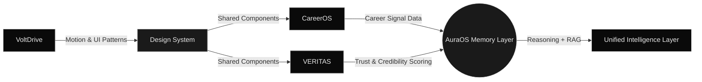
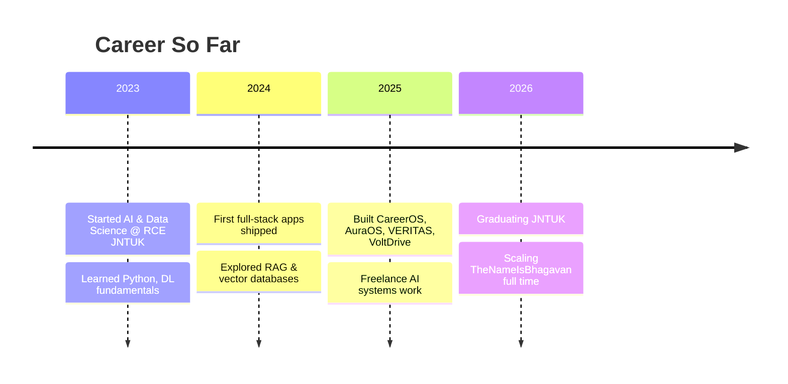

 

  

  

 

## Engineering Philosophy

> Systems, not screens. Every product here is built to reason, remember, and explain itself — not just render UI.

I'm **Gopala Josyula Siva Satya Sai Bhagavan** — building **TheNameIsBhagavan**, a long-term engineering ecosystem spanning AI infrastructure, full-stack products, and technical writing. Final-year AI & Data Science engineer at Ramachandra College of Engineering (JNTUK), graduating 2026.

 

## Flagship Systems

<table width="100%">
<tr>
<td width="50%" valign="top">

### 🧠 CareerOS
**AI Career Intelligence Platform**

Resume Intelligence · ATS Analyzer · GitHub Analyzer · Market Intelligence · AI Roadmap Generator — powered by live GitHub API integration and Gemini.

`React` `Flask` `FastAPI` `Gemini`

[**Live**](https://careeros-thenameisbhagavan.vercel.app/) · [**Source**](https://github.com/thenameisbhagavan/careeros)

</td>
<td width="50%" valign="top">

### 🌌 AuraOS
**Personal Intelligence Operating System**

Persistent memory, RAG retrieval, and conversational reasoning built on a Django + FastAPI microservice architecture with Pinecone as the memory layer.

`Django` `FastAPI` `Pinecone` `Gemini`

[**Live**](https://aura-os-thenameisbhagavan.vercel.app/) · [**Source**](https://github.com/thenameisbhagavan/auraos)

</td>
</tr>
<tr>
<td width="50%" valign="top">

### 🔍 VERITAS
**Explainable Intelligence Platform**

Claim extraction, live evidence retrieval, credibility scoring, and bias detection — no LLM API, pure NLP/ML pipeline built on spaCy, Transformers, and scikit-learn.

`React` `Flask` `spaCy` `Transformers`

[**Live**](https://veritas-thenameisbhagavan.vercel.app/) · [**Source**](https://github.com/thenameisbhagavan/veritas)

</td>
<td width="50%" valign="top">

### ⚡ VoltDrive
**Luxury Electric Vehicle Experience**

A production-grade automotive showcase — cinematic storytelling, interactive vehicle exploration, and Apple-level motion design.

`React` `Vite` `Framer Motion`

[**Live**](https://voltdrive-thenameisbhagavan.vercel.app/) · [**Source**](https://github.com/thenameisbhagavan/voltdrive)

</td>
</tr>
</table>

 

## How These Systems Connect

 

## Stack

 

**Frontend** — React · Vite · Framer Motion · React Router
**Backend** — Python (FastAPI, Flask) · Node.js (Express) · MongoDB
**AI / ML** — Deep Learning · Agentic AI · RAG · Reasoning Systems · NLP · Memory Systems
**Deployment** — Vercel · GitHub Actions · Cloudflare · Hostinger

 

## Engineering Timeline

 

## Activity

 

  

 

## Trophy Case

 

## Writing & Notes

- 📐 **Architecting AuraOS** — designing a memory layer that doesn't forget
- 🧩 **Inside VERITAS** — building credibility scoring without an LLM crutch
- ⚙️ **CareerOS internals** — turning a GitHub profile into a career signal
- 🎬 **Motion design in VoltDrive** — cinematic UI without a game engine

 

## Contribution Snake

Generated nightly via GitHub Actions from my contribution graph

 

## Skill Proficiency

**Python** `████████████████████░░` 90%
**React / JavaScript** `██████████████████░░░░` 85%
**FastAPI / Flask** `█████████████████░░░░░` 82%
**Deep Learning / NLP** `████████████████░░░░░░` 78%
**System Design** `███████████████░░░░░░░` 74%
**DevOps / Cloud** `█████████████░░░░░░░░░` 65%

 

## Experience Timeline

 

## Education

<table width="100%">
<tr>
<td width="15%" align="center">🎓</td>
<td width="85%">

**B.Tech in Artificial Intelligence & Data Science**
Ramachandra College of Engineering (JNTUK) · 2022 – 2026
Coursework: Machine Learning · Deep Learning · Data Structures & Algorithms · Distributed Systems · NLP

</td>
</tr>
</table>

 

## Certifications & Achievements

 

## Featured Repositories

 

 

## Open Source & Community

- 🔧 Contributing fixes and features to AI tooling libraries in the RAG / vector-search space
- 📚 Reviewing PRs and mentoring juniors on full-stack + AI project architecture
- 🗣️ Sharing build breakdowns and system design notes on the Engineering Journal
- 🌱 Occasional issue triage on open-source LLM orchestration frameworks

 

## Currently Exploring

 

## Quick Facts

<table>
<tr><td>🌍 Based in</td><td>Andhra Pradesh, India</td></tr>
<tr><td>💻 Daily drivers</td><td>Python · React · VS Code</td></tr>
<tr><td>🧭 Focus</td><td>AI systems that reason & remember</td></tr>
<tr><td>🎯 2026 goal</td><td>Ship TheNameIsBhagavan as a full product suite</td></tr>
<tr><td>☕ Fuel</td><td>Filter coffee & late-night debugging</td></tr>
</table>

 

## Support the Work

  

If any of these systems saved you time or sparked an idea, a star on the repos goes a long way.

 

## Let's Build Something

 

 

### Currently building the **Engineering Journal** — architecture write-ups on CareerOS, AuraOS, VERITAS & VoltDrive.

Follow along at <a href="https://www.thenameisbhagavan.in">thenameisbhagavan.in</a>

  

