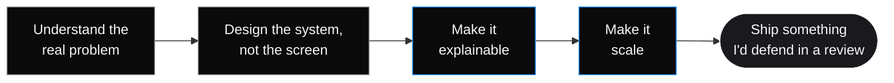
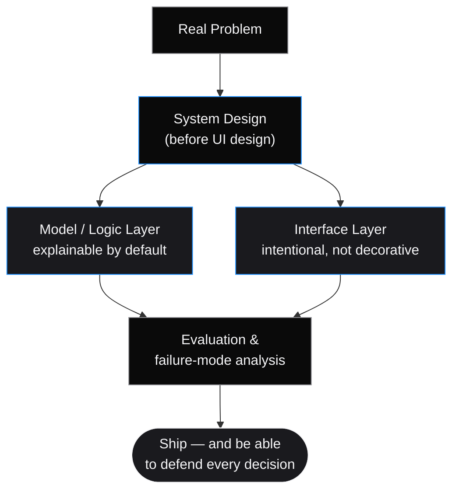
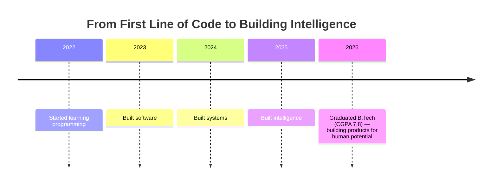

<!-- ============================================================
     GOPALA JOSYULA SIVA SATYA SAI BHAGAVAN — "TheNameIsBhagavan"
     GitHub Profile README
     ============================================================ -->

 

  

  
  
  

  
  
  
  

⚠️ <b>Placeholder notice:</b> replace <code>your-github-username</code> in the stats widgets below, and the LinkedIn / X / email links, before publishing.

 

<a href="#-manifesto"><b>Manifesto</b></a> ·
<a href="#-technology-stack"><b>Stack</b></a> ·
<a href="#-featured-products"><b>Products</b></a> ·
<a href="#-engineering-timeline"><b>Timeline</b></a> ·
<a href="#-github-statistics"><b>Stats</b></a> ·
<a href="#-contact"><b>Contact</b></a>

 

## Manifesto

> **Most people write code. Fewer people engineer systems.**
> The difference shows up under load — when the model is wrong, when the traffic spikes, when the edge case is the whole point. I care less about whether something *runs* and more about whether it *holds* — under scale, under scrutiny, under someone else's use case.

I'm **Gopala Josyula Siva Satya Sai Bhagavan** — building under the name **TheNameIsBhagavan**. I design and ship intelligent systems where AI, backend architecture, and human-centered frontend design have to agree with each other, not just coexist.

I completed my **B.Tech in April 2026 with a CGPA of 7.8** — but the degree closed one chapter of how I learned to build; the products below are the chapter that actually mattered.

<table>
<tr>
<td width="50%" valign="top">

### What I optimize for

- 🧠 Systems that can explain their own decisions
- ⚙️ Architecture that scales before it's asked to
- 🎨 Interfaces that feel inevitable, not decorated
- 🔬 Problems worth solving, not problems worth demoing

</td>
<td width="50%" valign="top">

### What I actively avoid

- ❌ Shipping a model without a failure mode
- ❌ UI that exists to look busy
- ❌ Architecture decisions I can't defend
- ❌ Features nobody asked to have solved

</td>
</tr>
</table>

 

## Engineering Philosophy

I don't build software — I engineer intelligent systems. That means AI reasoning, backend architecture, frontend experience, and product thinking are treated as one discipline, not four handoffs. Every project I ship has to answer three questions honestly: **does it solve something real, does it feel intentional, and could it survive production?**

 

## Current Focus

| | |
|:--|:--|
| 🔭 **Currently building** | Explainable AI systems and full-stack intelligence platforms |
| 🌱 **Currently learning** | Advanced retrieval architectures, agentic system design, distributed inference |
| 🤝 **Open to** | Collaborations on AI systems, product engineering roles, research conversations |
| 💬 **Ask me about** | AI system design, explainability, product engineering, career strategy |
| 📫 **Reach me** | [thenameisbhagavan.in](https://www.thenameisbhagavan.in) |

 

 

## Technology Stack

<table>
<tr><td align="center" width="18%"><b>AI / GenAI</b></td><td width="82%">

</td></tr>
<tr><td align="center"><b>Frontend</b></td><td>

</td></tr>
<tr><td align="center"><b>Backend</b></td><td>

</td></tr>
<tr><td align="center"><b>Cloud &amp; DevOps</b></td><td>

</td></tr>
</table>

 

## Featured Products

PLACEHOLDER — all links below are as provided; confirm they're live before publishing.

<table>
<tr>
<td width="50%" valign="top">

### 🧭 CareerOS
**The Intelligence Layer For Every Career.**

An AI-powered career intelligence platform — reasoning over a person's trajectory rather than just matching keywords to job titles.

</td>
<td width="50%" valign="top">

### 🌌 AuraOS
**Personal Intelligence Operating System.**

Persistent memory, reasoning, and knowledge layered into a conversational interface built for continuity, not one-off chat sessions.

</td>
</tr>
<tr>
<td width="50%" valign="top">

### 🔎 VERITAS
**Explainable Intelligence Platform.**

Evidence-first claim verification — every credibility score ships with the reasoning trace that produced it, not just a verdict.

</td>
<td width="50%" valign="top">

### ⚡ VoltDrive
**Luxury Automotive Experience.**

Premium motion design paired with modern frontend engineering — proof that product craft isn't limited to AI-shaped problems.

</td>
</tr>
</table>

 

## Architecture Philosophy

Across CareerOS, AuraOS, VERITAS, and VoltDrive, the same discipline repeats: **system design comes before interface design**, every AI-driven decision has a traceable failure mode, and nothing ships until I can explain — to myself, first — why it's built the way it's built.

 

 

## Engineering Timeline

 

## GitHub Statistics

 

 

 PLACEHOLDER — replace <code>your-github-username</code> with your actual GitHub username in every widget above.

 

## Achievements & Certifications

PLACEHOLDER — add your certifications, hackathon wins, or publications here.

<table>
<tr><td align="center" width="33%">🏆 Add achievement</td><td align="center" width="33%">📜 Add certification</td><td align="center" width="34%">✍️ Add publication</td></tr>
</table>

 

 

## Contact

 PLACEHOLDER — replace email and LinkedIn link with your real contact details.

 

> *"I don't build to demo. I build to hold."*

 

TheNameIsBhagavan · AI Engineer · Full Stack Developer · Building intelligent systems, one defendable decision at a time.

